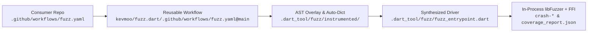

# Continuous Fuzzing with GitHub Actions

`package:fuzz` provides a reusable GitHub Actions workflow
([`.github/workflows/fuzz.yaml`](../.github/workflows/fuzz.yaml)) that runs
in-process `libFuzzer` + `dart:ffi` coverage-guided AST fuzzing (`--mode=cgf`)
or pure-Dart evolutionary fuzzing (`--mode=pure-dart`) on push, pull request,
and scheduled CI runs—without adding `package:fuzz` or `package:analyzer` to
your package's `pubspec.yaml`.

## How It Works End-to-End



1. **Zero-Dependency Target (`test/fuzz/<name>_fuzz.dart`)**:
   - Your target script defines a top-level `void fuzzTarget(Uint8List bytes)`
     function using only `dart:typed_data` and your package's own imports.
   - Because `test/fuzz/<name>_fuzz.dart` does not import
     `package:fuzz/fuzz.dart`, your package's `pubspec.yaml` requires **zero
     fuzzing dependencies**, keeping `dart analyze --fatal-infos`,
     `lower_bound.yml`, and `dart pub publish --dry-run` completely unaffected.
2. **Non-Destructive AST Overlay (`.dart_tool/fuzz/`)**:
   - The reusable workflow installs `clang`, `llvm`, and `libclang-rt-dev`,
     activates `package:fuzz` globally from `kevmoo/fuzz.dart`, and runs
     `fuzz run`.
   - `PackageOverlayInstrumentor` rewrites your package's `lib/` directory (plus
     any `instrument-packages` dependencies) into
     `.dart_tool/fuzz/instrumented/` with `$fuzzEdge`, `$fuzzEq`/`$fuzzLt`, and
     `$fuzzSwitch` hooks, harvests string/regex/character literals into
     `.dart_tool/fuzz/auto.dict`, and writes an overlay
     `.dart_tool/fuzz/package_config.json` that automatically maps
     `package:fuzz`.
3. **Driver Entrypoint Synthesis (`.dart_tool/fuzz/fuzz_entrypoint.dart`)**:
   - When the target script defines `void fuzzTarget(Uint8List bytes)` without
     calling `FuzzRuntime.runDriver` directly, `fuzz run` synthesizes
     `.dart_tool/fuzz/fuzz_entrypoint.dart` wrapping `target.fuzzTarget(data)`
     inside `FuzzRuntime.runDriver`.
   - Advanced targets that use `package:fuzz/fuzz.dart` combinators or custom
     `FuzzRuntime.runDriver` callbacks can still define
     `main(List<String> args)` directly.
4. **Native `libFuzzer` Execution & Artifact Upload**:
   - Compiles `fuzzer.cc` with `clang++ -fsanitize=fuzzer-no-link` into
     `.dart_tool/fuzz/libfuzzer_dart.so` (`65,536` 8-bit inline edge counters,
     `512` distinct-PC `TraceCmp8WithPc` trampolines, and `TraceMemcmp`
     byte-loop coalescing).
   - Runs `libFuzzer` in-process over `dart:ffi` with `-use_value_profile=1` and
     `-dict=.dart_tool/fuzz/auto.dict` until `max-total-time` or `runs` is
     reached.
   - If an unexpected exception (`RangeError`, `StateError`, `TypeError`,
     `AssertionError`) or oracle mismatch occurs, `libFuzzer` writes a minimal
     `crash-<sha1>` reproducer file and exits with code `77` (failing the CI
     check).
   - At the end of the job (`if: always()`), `actions/upload-artifact@v4`
     uploads any `crash-*` reproducers along with
     `.dart_tool/fuzz/coverage_report.json` (per-file and per-line AST site
     coverage and `uncoveredLines`).

## Step 1: Add a Zero-Dependency Fuzz Target

Create `test/fuzz/<name>_fuzz.dart` in your package:

```dart
import 'dart:convert';
import 'dart:typed_data';

import 'package:my_pkg/my_pkg.dart';

void fuzzTarget(Uint8List bytes) {
  final text = utf8.decode(bytes, allowMalformed: true);
  try {
    parseMyFormat(text);
  } on FormatException {
    // Expected rejection on malformed input.
  }
}
```

## Step 2: Add `.github/workflows/fuzz.yaml`

### Single-Package Repository (with Delegated Dependency Instrumentation)

```yaml
name: Fuzz

on:
  push:
    branches: [main]
  pull_request:
  schedule:
    - cron: '0 6 * * 1'

jobs:
  fuzz:
    uses: kevmoo/fuzz.dart/.github/workflows/fuzz.yaml@main
    with:
      target: test/fuzz/my_parser_fuzz.dart
      instrument-packages: string_scanner,source_span
      max-total-time: 30
```

### Multi-Package Repository (Monorepo)

```yaml
name: Fuzz

on:
  push:
    branches: [main]
  pull_request:
  schedule:
    - cron: '0 6 * * 1'

jobs:
  fuzz-pkg-a:
    uses: kevmoo/fuzz.dart/.github/workflows/fuzz.yaml@main
    with:
      package-root: pkgs/pkg_a
      target: test/fuzz/pkg_a_fuzz.dart
      max-total-time: 30

  fuzz-pkg-b:
    uses: kevmoo/fuzz.dart/.github/workflows/fuzz.yaml@main
    with:
      package-root: pkgs/pkg_b
      target: test/fuzz/pkg_b_fuzz.dart
      max-total-time: 30
```

## Reusable Workflow Inputs

| Input                 | Type     | Default             | Description                                                                                                                            |
| :-------------------- | :------- | :------------------ | :------------------------------------------------------------------------------------------------------------------------------------- |
| `target`              | `string` | _(required)_        | Path to the Dart fuzz harness script (relative to `package-root`).                                                                     |
| `package-root`        | `string` | `'.'`               | Directory of the target package to instrument and fuzz.                                                                                |
| `mode`                | `string` | `'cgf'`             | Fuzzing mode (`cgf` for `libFuzzer` + `dart:ffi`, or `pure-dart`).                                                                     |
| `runs`                | `number` | `200000`            | Maximum number of fuzzing executions (`-runs=<N>`).                                                                                    |
| `max-len`             | `number` | `4096`              | Maximum input length in bytes (`-max_len=<N>`).                                                                                        |
| `max-total-time`      | `number` | `60`                | Maximum total fuzzing time in seconds (`-max_total_time=<S>`).                                                                         |
| `instrument-packages` | `string` | `''`                | Comma-separated dependency packages from `package_config.json` to AST-instrument alongside the root package (e.g. `yaml,source_span`). |
| `work-dir`            | `string` | `'.dart_tool/fuzz'` | Directory for the instrumented AST overlay, `auto.dict`, and `coverage_report.json`.                                                   |
| `dict`                | `string` | `''`                | Optional path to a custom AFL/`libFuzzer` dictionary file (merged with `auto.dict`).                                                   |
| `sdk`                 | `string` | `'dev'`             | Dart SDK channel (`stable`, `beta`, `dev`, `main`).                                                                                    |

## Reproducing a CI Crash Locally

When a CI run fails and uploads a `crash-<sha1>` artifact:

```bash
# Re-run against the single crash reproducer file:
dart pub global run fuzz run \
  --package-root=. \
  --target=test/fuzz/my_parser_fuzz.dart \
  -- crash-<sha1>
```
